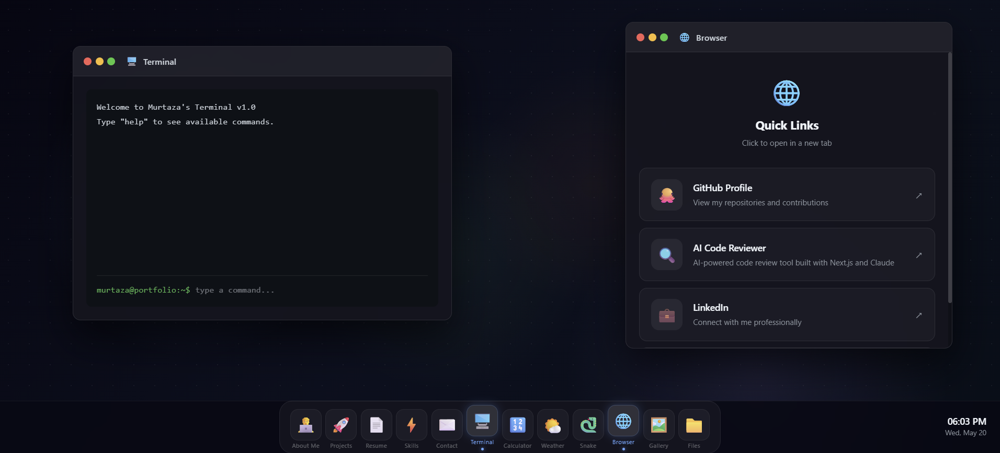

# Dev Portfolio OS

An interactive portfolio built as a fully functional desktop OS experience. Features 12 draggable apps including a live terminal, snake game, real-time weather, calculator, project showcase, and more.

🌐 **Live Demo:** https://portfolio-os-one-chi.vercel.app

## Apps

- 👨‍💻 **About Me** — Bio, contact info, and certifications
- 🚀 **Projects** — Showcase of my work with tech stack and GitHub links
- 📄 **Resume** — Education, experience, and certifications
- ⚡ **Skills** — Full tech stack organized by category
- ✉️ **Contact** — All contact links in one place
- 🖥️ **Terminal** — Functional terminal with custom commands
- 🔢 **Calculator** — Fully working calculator
- 🌤️ **Weather** — Live weather for San Luis Obispo, CA
- 🐍 **Snake** — Playable snake game with score tracking
- 🌐 **Browser** — Quick links to my profiles
- 🖼️ **Gallery** — Visual project gallery
- 📁 **File Explorer** — Browse projects and certifications

## Tech Stack

- **Framework** — Next.js 16 with App Router
- **Language** — TypeScript
- **Styling** — Tailwind CSS + custom animations
- **Weather API** — Open-Meteo (free, no API key needed)
- **Deployment** — Vercel

## Live Demo

Visit the live site: **https://portfolio-os-one-chi.vercel.app**

No installation needed — just open the link and explore!