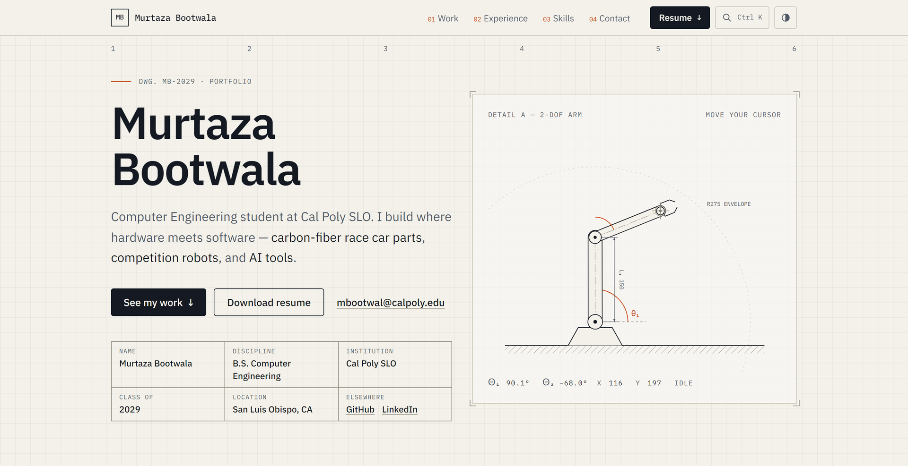

# Murtaza Bootwala — Portfolio

A personal portfolio for a Computer Engineering student at Cal Poly SLO, designed as a technical drawing: title blocks, part numbers, dimension lines, and an interactive robot arm you can steer with your cursor.

**[portfolio-os-one-chi.vercel.app →](https://portfolio-os-one-chi.vercel.app)**

<picture>
  <source media="(prefers-color-scheme: dark)" srcset="./screenshot-dark.png">
  
</picture>

## The concept

My work sits between hardware and software — composite parts for a Formula SAE car, fabrication for a competition robot, and AI tools — so the site borrows the visual language engineers already use to communicate: the engineering drawing.

- The homepage is laid out like a **drawing sheet**, with zone markers, a title block, and ruled section headers.
- Projects read as **parts on a parts list**, each with its own part number (`PRJ-001`, `PRJ-002`, …).
- Experience is presented as a **revision history**, and skills as a **bill of materials**.
- The hero is **Detail A**: a two-joint robot arm drawn in line art that follows your cursor in real time.

## Highlights

### Interactive 2-DOF robot arm
The hero drawing solves two-link inverse kinematics every animation frame, so the arm's wrist stays locked to your cursor — even under fast, erratic movement. Joint angles, wrist coordinates, and reach status update live beneath the drawing, and a dimension line and angle arcs move with the arm. When no one is steering, it traces a slow figure-eight. It pauses when scrolled out of view and stays still for visitors who prefer reduced motion.

### Spec-sheet case studies
Selected projects each have a dedicated case study page with a specifications table and a numbered breakdown of the work:

- **Formula SAE carbon chassis** with Cal Poly Racing and **FRC robot fabrication** with Team 2976 Spartabots — contributions and the fabrication processes involved.
- **Sakkas Poster** — a live full-stack app that automates social media posting for Sakkas Store, a Shopify-based fashion brand. It turns a product URL into a Facebook and Instagram carousel post with a Claude-written caption, and the case study covers the real engineering problems along the way: a mid-project Shopify auth migration, Meta's permission-flow change, and replacing an unreliable GitHub Actions cron with a Supabase pg_cron scheduler.
- **sakkas-inven-app** — a QR-code warehouse inventory system for Sakkas Store, built to replace searching aisles by handwritten labels. Each box's QR code points to a database record, so a scan always shows live contents, location, and quantity.

### Command palette
Press <kbd>⌘</kbd> <kbd>K</kbd> (or <kbd>Ctrl</kbd> <kbd>K</kbd>) anywhere to jump to a section or case study, download the resume, copy the email address, open GitHub or LinkedIn, or switch themes — all from the keyboard.

### Two themes
A warm **drafting-vellum** light theme and a navy **blueprint** dark theme. The site follows your system preference, and the toggle remembers your choice without a flash of the wrong colors on load.

### Portfolio OS (easter egg)
The original version of this site lives on at **[/os](https://portfolio-os-one-chi.vercel.app/os)**: a desktop-style OS in the browser with draggable, resizable windows, a taskbar, a working terminal, a calculator, live weather, and Snake.

### Built to be usable by everyone
Semantic HTML, full keyboard navigation, visible focus states, and screen-reader labels throughout. Every page is statically generated and responsive down to small phone widths.

## Built with

- **[Next.js 16](https://nextjs.org)** (App Router, static generation) and **React 19**
- **TypeScript**
- **[Tailwind CSS v4](https://tailwindcss.com)** with CSS-variable design tokens for both themes
- **IBM Plex Sans & IBM Plex Mono**
- **Inline SVG** for the robot arm and drawing details — no graphics libraries
- **[Vitest](https://vitest.dev)** unit tests covering the inverse-kinematics solver and other core logic
- **[Vercel](https://vercel.com)** for hosting, with **Vercel Web Analytics**
- **[Open-Meteo](https://open-meteo.com)** for live weather in Portfolio OS

## Get in touch

- **Email:** [mbootwal@calpoly.edu](mailto:mbootwal@calpoly.edu)
- **LinkedIn:** [linkedin.com/in/murtazabootwala25](https://www.linkedin.com/in/murtazabootwala25)
- **GitHub:** [github.com/durtymurty](https://github.com/durtymurty)
- **Resume:** [download PDF](https://portfolio-os-one-chi.vercel.app/resume.pdf)
